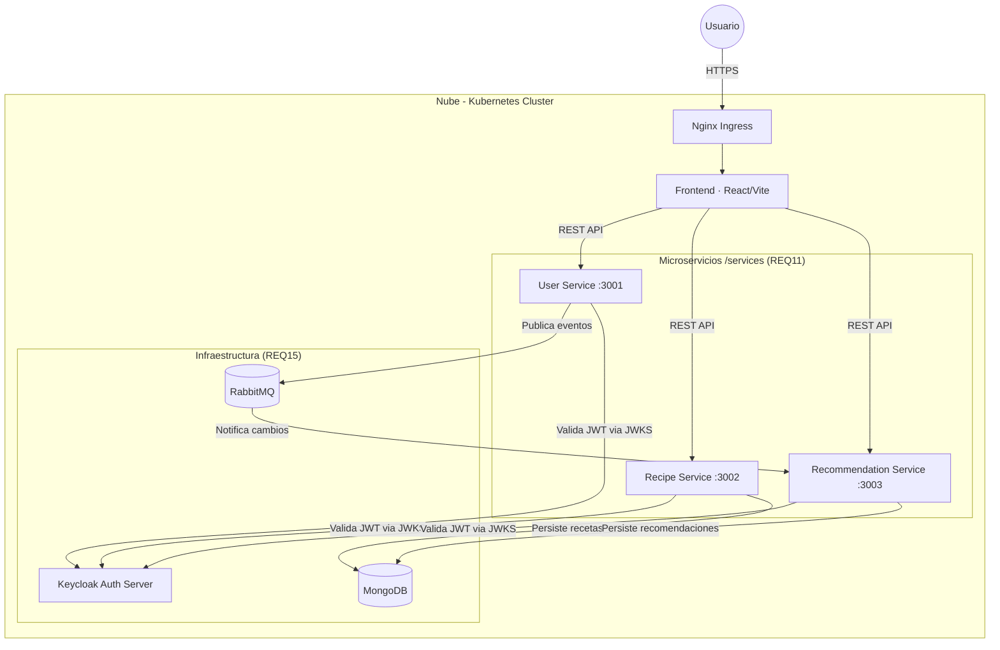
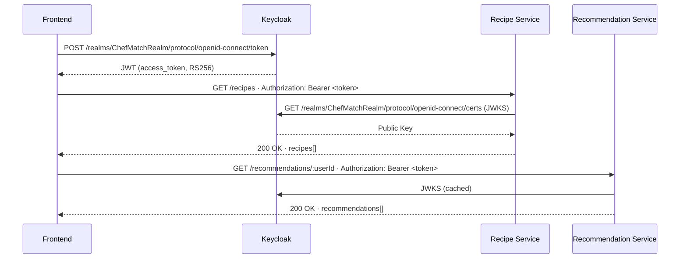
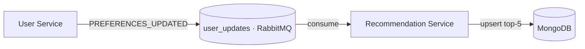

# System Architecture - ChefMatch (REQ17)

Este documento describe la arquitectura de microservicios distribuida del proyecto ChefMatch.

## 1. Estructura del Repositorio
Siguiendo un diseño modular, el proyecto se organiza de la siguiente manera:
- **/services**: Contiene los microservicios core (user-service, recipe-service, recommendation-service).
- **/frontend**: Interfaz de usuario interactiva.
- **/k8s**: Manifiestos de orquestación para el despliegue en la nube.

## 2. Diagrama de Contenedores (C4 Model - Level 2)



## 3. Autenticación y Control de Acceso Basado en Roles (RBAC)

### 3.1 Flujo de Autenticación

La autenticación se delega íntegramente a **Keycloak**, que actúa como Identity Provider (IdP). El flujo es el siguiente:



### 3.2 Roles definidos en Keycloak

| Rol | Descripción | Permisos |
|-----|-------------|----------|
| `user` | Usuario registrado estándar | Leer recetas, ver sus recomendaciones, actualizar su perfil |
| `chef` | Usuario con permisos de creación | Todo lo de `user` + crear y eliminar sus propias recetas |
| `admin` | Administrador de la plataforma | Acceso completo, gestión de usuarios, eliminación de cualquier receta |

Los roles se configuran en Keycloak bajo **Realm Roles** y se incluyen automáticamente en el claim `realm_access.roles` del JWT.

### 3.3 Aplicación de RBAC por servicio

**User Service** (`/services/user-service`)
- `POST /register` — público
- `POST /login` — público
- `GET /profile` — requiere token válido (`user`, `chef`, `admin`)
- `GET /logout` — requiere token válido

**Recipe Service** (`/services/recipe-service`)
- `GET /recipes` — público (`optionalAuthJWT`)
- `POST /recipes` — requiere token válido; rol recomendado: `chef` o `admin`
- `DELETE /recipes/:id` — requiere token válido; solo elimina recetas dinámicas (MongoDB), no estáticas

**Recommendation Service** (`/services/recommendation-service`)
- `GET /recommendations/:userId` — requiere token válido (`user`, `chef`, `admin`)
- El servicio verifica que `req.user.sub` corresponde al `userId` solicitado para evitar accesos cruzados

### 3.4 Implementación del middleware JWT

Todos los servicios de backend utilizan la librería `jwks-rsa` para verificar tokens sin gestionar secretos compartidos. La clave pública se descarga del endpoint JWKS de Keycloak y se cachea 10 minutos:

```javascript
// Patrón común en middleware/auth.js de cada servicio
const client = jwksClient({
  jwksUri: `${KEYCLOAK_URL}/realms/${KEYCLOAK_REALM}/protocol/openid-connect/certs`,
  cache: true,
  cacheMaxAge: 600000,       // 10 minutos
  rateLimit: true,
  jwksRequestsPerMinute: 10  // Protección contra abuso
});

jwt.verify(token, getKey, {
  audience: KEYCLOAK_CLIENT_ID,
  issuer: `${KEYCLOAK_URL}/realms/${KEYCLOAK_REALM}`,
  algorithms: ['RS256']      // Solo RS256, nunca HS256
}, callback);
```

La elección de **RS256** (firma asimétrica) sobre HS256 es intencional: los microservicios solo necesitan la clave pública para verificar tokens, nunca tienen acceso al secreto de firma de Keycloak.

### 3.5 Variables de entorno requeridas

Todas las configuraciones sensibles se inyectan como variables de entorno definidas en `k8s/templates/secrets.yaml`, nunca hardcodeadas en el código:

| Variable | Servicio | Descripción |
|----------|----------|-------------|
| `KEYCLOAK_URL` | user, recipe, recommendation | URL base del servidor Keycloak |
| `KEYCLOAK_REALM` | user, recipe, recommendation | Nombre del realm (`ChefMatchRealm`) |
| `KEYCLOAK_CLIENT_ID` | user, recipe, recommendation | Client ID de la aplicación |
| `KEYCLOAK_CLIENT_SECRET` | user-service | Secret del cliente (solo user-service vía `keycloak-connect`) |
| `MONGODB_URI` | recipe, recommendation | Cadena de conexión a MongoDB |
| `RABBITMQ_URL` | user, recommendation | URL del broker de mensajería |

## 4. Comunicación Asíncrona (REQ15)

El **User Service** publica un evento `PREFERENCES_UPDATED` en la cola `user_updates` de RabbitMQ cada vez que un usuario modifica sus preferencias culinarias. El **Recommendation Service** consume esa cola y regenera automáticamente las recomendaciones personalizadas para ese usuario en MongoDB.



## 5. Observabilidad (REQ13)

El **Recipe Service** expone métricas en formato Prometheus en el endpoint `GET /metrics` usando la librería `prom-client`. Estas métricas incluyen latencia HTTP por ruta y código de estado, además de las métricas de proceso por defecto (CPU, memoria, event loop).

Prometheus y Grafana se despliegan en el cluster vía `k8s/templates/monitoring.yaml` con almacenamiento persistente (PVC), y Prometheus scrapeará automáticamente los pods anotados con `prometheus.io/scrape: "true"`.
