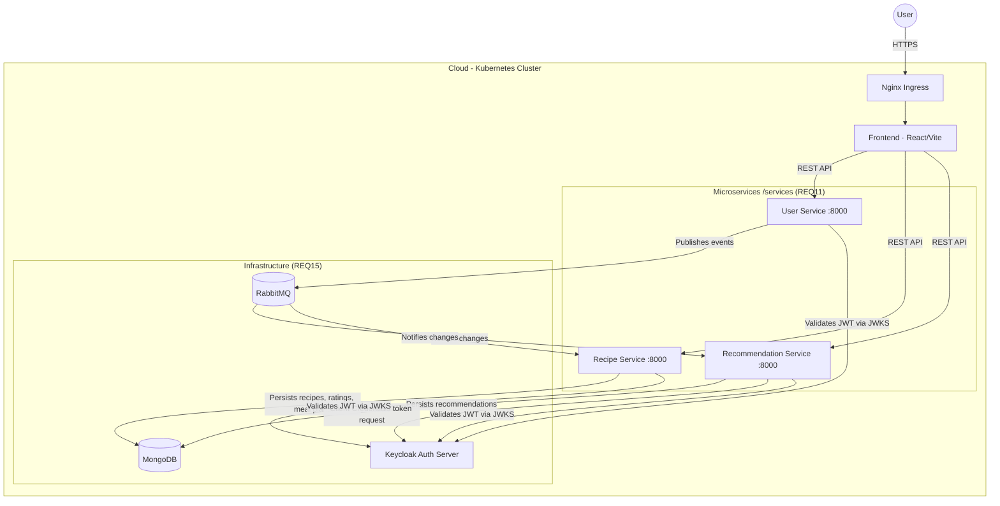
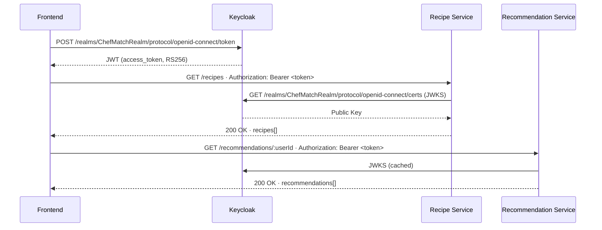
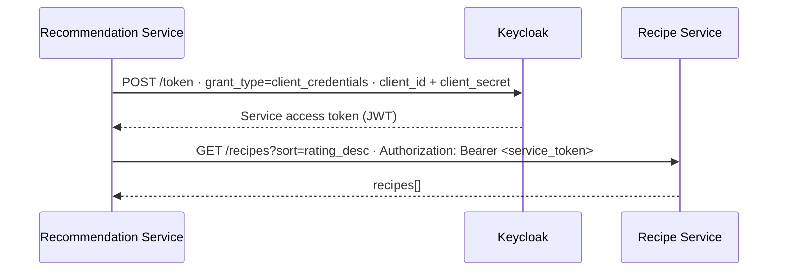
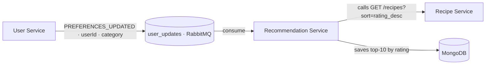
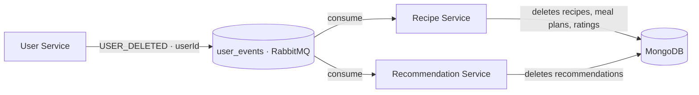

# System Architecture - ChefMatch (REQ17)

This document describes the distributed microservices architecture of the ChefMatch project.

## 1. Repository Structure

Following a modular design, the project is organised as follows:

- **/services** — Core microservices: `user-service`, `recipe-service`, `recommendation-service`.
- **/frontend** — Interactive user interface (React/Vite).
- **/k8s** — Orchestration manifests for cloud deployment.

---

## 2. Container Diagram (C4 Model - Level 2)



---

## 3. Authentication

### 3.1 Authentication Flow

Authentication is fully delegated to **Keycloak**, which acts as the Identity Provider (IdP). The flow is as follows:



### 3.2 Endpoint Protection per Service

No custom roles are defined in Keycloak. Access control is based solely on **token validity** and **resource ownership** (the `sub` claim in the JWT is compared to the requested resource's owner).

**User Service** (`/services/user-service`)

| Method | Endpoint | Auth required |
|--------|----------|---------------|
| GET | `/users/health` | No |
| GET | `/users/:id` | Yes · own profile only (`req.user.sub === id`) |
| POST | `/users/preferences` | Yes |
| DELETE | `/users/account` | Yes |

**Recipe Service** (`/services/recipe-service`)

| Method | Endpoint | Auth required |
|--------|----------|---------------|
| GET | `/health` | No |
| GET | `/recipes` | No |
| POST | `/recipes` | Yes |
| DELETE | `/recipes/:id` | Yes · own recipes only (`recipe.userId === req.user.sub`) |
| POST | `/recipes/:id/rate` | Yes · one rating per user per recipe |
| GET/POST/PUT/DELETE | `/meal-plans/...` | Yes · own meal plans only |
| GET | `/metrics` | No |

**Recommendation Service** (`/services/recommendation-service`)

| Method | Endpoint | Auth required |
|--------|----------|---------------|
| GET | `/health` | No |
| GET | `/recommendations/:userId` | Yes |
| GET | `/recommendations/:userId/all` | Yes |
| GET | `/metrics` | No |

### 3.3 JWT Middleware Implementation

All backend services use the `jwks-rsa` library to verify tokens without managing shared secrets. The public key is downloaded from Keycloak's JWKS endpoint and cached for 10 minutes:

```javascript
// Common pattern in middleware/auth.js of each service
const client = jwksClient({
  jwksUri: `${KEYCLOAK_URL}/realms/${KEYCLOAK_REALM}/protocol/openid-connect/certs`,
  cache: true,
  cacheMaxAge: 600000,       // 10 minutes
  rateLimit: true,
  jwksRequestsPerMinute: 10  // Protection against abuse
});

jwt.verify(token, getKey, {
  audience: KEYCLOAK_CLIENT_ID,
  issuer:   `${KEYCLOAK_URL}/realms/${KEYCLOAK_REALM}`,
  algorithms: ['RS256']      // RS256 only, never HS256
}, callback);
```

**Why RS256 over HS256:** RS256 uses asymmetric cryptography. Microservices only need the public key to verify tokens — they never have access to Keycloak's private signing key. This means a compromised microservice cannot forge tokens.

### 3.4 Service-to-Service Authentication (Client Credentials)

The `recommendation-service` needs to call `GET /recipes` on the `recipe-service` (which requires a valid JWT), but there is no human user involved in this call. It uses the **OAuth2 Client Credentials flow**:



The token is cached and reused until it has less than 30 seconds of remaining validity, at which point a new one is requested.

### 3.5 Required Environment Variables

All sensitive configuration is injected as environment variables defined in `k8s/templates/secrets.yaml`. Nothing is hardcoded in the source code:

| Variable | Service | Description |
|----------|---------|-------------|
| `KEYCLOAK_URL` | user, recipe, recommendation | Base URL of the Keycloak server |
| `KEYCLOAK_REALM` | user, recipe, recommendation | Realm name (`ChefMatchRealm`) |
| `KEYCLOAK_CLIENT_ID` | user, recipe, recommendation | Application client ID |
| `KEYCLOAK_CLIENT_SECRET` | recommendation | Secret for Client Credentials flow |
| `MONGO_URI` | user, recipe, recommendation | MongoDB connection string |
| `RABBITMQ_URL` | user, recommendation | Messaging broker URL |
| `RECIPE_SERVICE_URL` | recommendation | Internal URL of the recipe-service |

---

## 4. Asynchronous Communication (REQ15)

Services communicate via **RabbitMQ** for operations that must propagate across multiple services without tight coupling. There are two queues:

### Queue: `user_updates`

Published by `user-service` when a user changes their food category preference. Consumed by `recommendation-service`, which regenerates personalised recommendations from the real recipe data in MongoDB.



### Queue: `user_events`

Published by `user-service` when a user deletes their account. Consumed by both `recipe-service` and `recommendation-service` to delete all data belonging to that user (cascade deletion across services).



Both services retry the RabbitMQ connection every 5 seconds if the broker is unavailable at startup.

---

## 5. Observability (REQ13)

All three services expose HTTP metrics in Prometheus format via `prom-client`. The following metrics are tracked per service:

| Metric | Type | Description |
|--------|------|-------------|
| `http_request_duration_seconds` | Histogram | Response time per route and status code |
| `http_requests_total` | Counter | Total requests per route and status code |
| `http_request_errors_total` | Counter | Error requests (4xx/5xx) with error type label |

Prometheus and Grafana are deployed in the cluster via `k8s/templates/monitoring.yaml` with persistent storage (PVC). Prometheus automatically scrapes pods annotated with `prometheus.io/scrape: "true"`.

---

## 6. Data Persistence

All persistent data is stored in a single **MongoDB** instance (`mongo-service:27017`, database `chefmatch`) with separate collections per service domain:

| Collection | Owner service | Description |
|------------|---------------|-------------|
| `recipes` | recipe-service | Recipe documents with rating fields |
| `ratings` | recipe-service | One rating per user per recipe (enforced by unique index) |
| `mealplans` | recipe-service | Monthly meal plans, one per user per month/year |
| `users` | user-service | User profiles and food category preferences |
| `recommendations` | recommendation-service | Top-10 recommendations per user, TTL 7 days |

Recommendations have a **7-day TTL** (`expires: 604800` in the schema) so MongoDB automatically removes stale data without manual cleanup.
